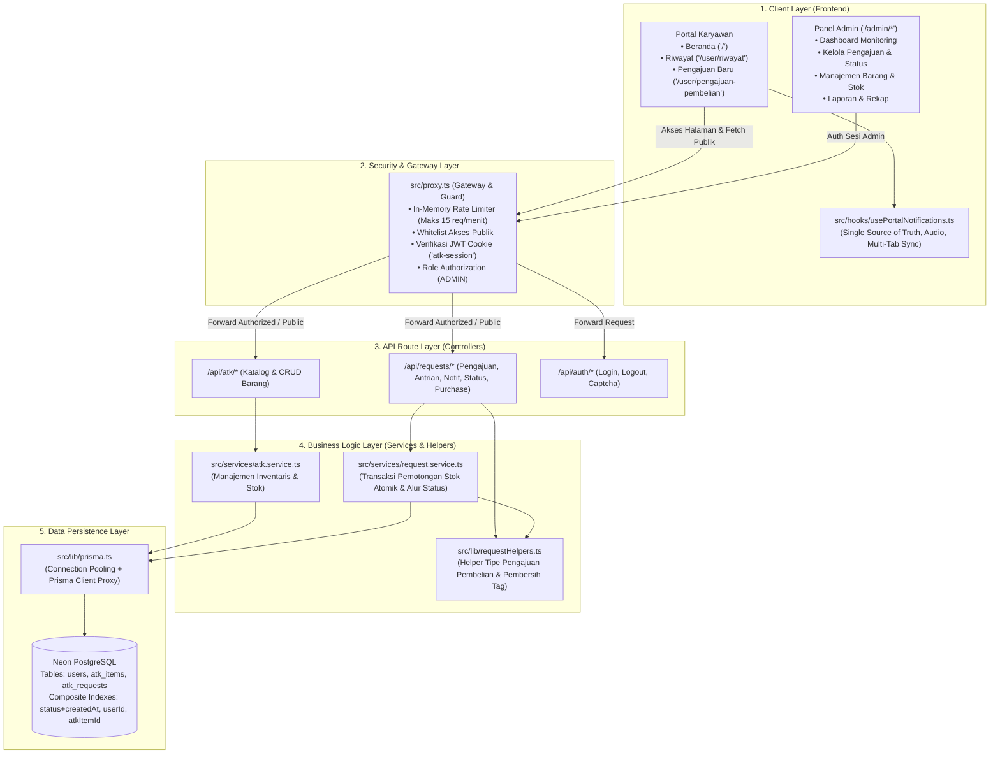
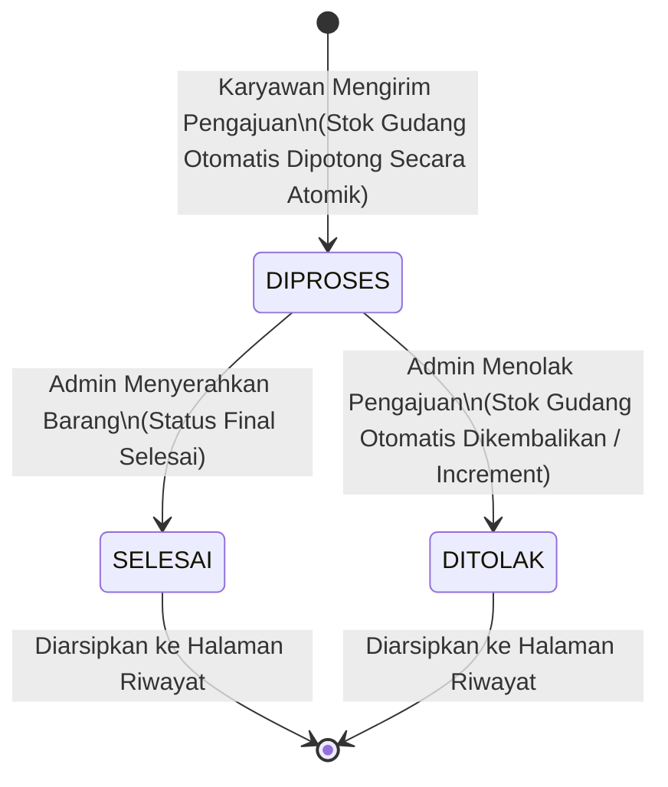

# 🏛️ Arsitektur Sistem Pengajuan ATK

Dokumen ini menyajikan arsitektur teknis dari aplikasi **Sistem Pengajuan ATK (Hasamitra Jabar)** berbasis **Next.js 16 (App Router)**. Dokumen dirancang ringkas, menyeluruh, serta berfokus pada alur sistem, keandalan konkurensi, dan **file-file penting yang sering dikonfigurasi**.

---

## 1. Stack Teknologi & Pola Arsitektur

Aplikasi mengadopsi pola **Layered Architecture (Arsitektur Berlapis)** dengan fokus pada integritas data, performa tinggi, dan ketahanan sistem:

| Lapisan | Teknologi / Pustaka | Fungsi Utama |
|---|---|---|
| **Frontend Framework** | **Next.js 16.3.1 (App Router)** & **React 19** | Server/Client Components, file-based routing, Error Boundaries |
| **Styling & UI** | **Tailwind CSS v4** | Utility-first styling modern, shimmer skeleton, print-optimized styles |
| **Security & Gateway** | **`src/proxy.ts`** & **`jose` (JWT)** | Proteksi rute admin, in-memory rate limiting publik, URL redirection |
| **ORM & Database** | **Prisma v7** + **Neon PostgreSQL** | Multi-column composite indexes, atomic operations, pool adapter |
| **Validasi & Utilitas** | **Zod** & **xlsx** | Validasi payload request, pembersihan tag XSS otomatis, ekspor excel |



---

## 2. File-File Penting & Panduan Konfigurasi

Berikut berkas utama yang paling sering diperiksa atau dikonfigurasi saat pemeliharaan dan pengembangan fitur baru:

### ⚙️ 1. [`.env`](file:///d:/Project/Code/NextJs/Hasamitra/Alat%20Tulis%20Kantor/.env) — *Environment Variables*
Menyimpan kredensial penting lingkungan runtime aplikasi:
* `DATABASE_URL`: String koneksi PostgreSQL Neon dengan mode pooler (`sslmode=verify-full`).
* `AUTH_SECRET`: Kunci enkripsi verifikasi JWT token untuk sesi admin.
* `ADMIN_EMAIL` & `ADMIN_PASSWORD`: Akun default saat inisialisasi basis data (`db:seed`).

### 🛡️ 2. [`src/proxy.ts`](file:///d:/Project/Code/NextJs/Hasamitra/Alat%20Tulis%20Kantor/src/proxy.ts) — *Middleware & Security Gateway*
Pusat kontrol penjaga akses seluruh rute di aplikasi (menggantikan middleware lama):
* **Rate Limiting Publik**: Membatasi frekuensi request pengajuan publik (`POST /api/requests` dan `POST /api/requests/purchase`) maksimum 15 permohonan per menit per IP untuk mencegah serangan bot/spam.
* **Public Frontend Pages**: Rute halaman yang boleh dibuka siapapun tanpa login (`/`, `/user/riwayat`, `/user/pengajuan-pembelian`, `/admin/login`).
* **Public API Endpoints**: Endpoint data publik (`/api/atk` [GET], `/api/requests` [GET/POST], `/api/requests/portal-notifications` [GET]).
* **Protected Routes**: Rute yang wajib menyertakan cookie JWT admin valid (`/admin/*` dan administrative API).

> [!IMPORTANT]
> Jika Anda menambahkan halaman publik baru atau endpoint API baru untuk portal karyawan, **wajib mendaftarkannya di `src/proxy.ts`**, agar tidak dicegat error `401 Unauthorized`.

### 🗃️ 3. [`prisma/schema.prisma`](file:///d:/Project/Code/NextJs/Hasamitra/Alat%20Tulis%20Kantor/prisma/schema.prisma) — *Database Schema & Model*
Definisi skema tabel, relasi, enum, dan indeks performa:
* **`User`**: Data pengguna (karyawan pemohon atau admin). Index: `department`.
* **`AtkItem`**: Katalog barang inventaris fisik dan kuantitas stok. Index: `name`, `isActive`.
* **`AtkRequest`**: Riwayat pengajuan barang dengan **composite index** untuk query instan:
  * `@@index([status, createdAt])` (antrian & polling)
  * `@@index([userId])` (filter riwayat per pemohon)
  * `@@index([atkItemId])` (agregasi laporan per barang)
  * `@@index([createdAt])` (filter rentang tanggal)
* **`RequestStatus`**: Siklus hidup status pengajuan (**`DIPROSES`**, **`DITOLAK`**, **`SELESAI`**).

### ⚡ 4. [`src/services/request.service.ts`](file:///d:/Project/Code/NextJs/Hasamitra/Alat%20Tulis%20Kantor/src/services/request.service.ts) — *Core Business Logic & Atomic Stock*
Mengatur transaksi atomik database (`prisma.$transaction`):
* **Atomic Decrement/Increment**: Mutasi stok menggunakan operator atomik database (`stock: { decrement: qty }` & `stock: { increment: qty }`) untuk mencegah *race condition* atau *lost update*.
* **Stock Deficit Protection**: Pengecekan stok fisik terkini di dalam transaksi database sebelum pemotongan stok; menolak permohonan jika kuantitas diminta melebihi stok tersedia.
* **Status Reversal**: Mengembalikan stok secara atomik jika permohonan ditolak, dan memotong kembali jika status penolakan dibatalkan.

### 🧩 5. [`src/lib/requestHelpers.ts`](file:///d:/Project/Code/NextJs/Hasamitra/Alat%20Tulis%20Kantor/src/lib/requestHelpers.ts) — *Centralized Request Helper Utilities*
Single source of truth untuk identifikasi dan parsing pengajuan:
* `PURCHASE_TAG`: Konstanta `[PENGAJUAN PEMBELIAN ATK BARU]`.
* `isPurchaseRequest(reason)`: Validasi apakah permohonan merupakan pengadaan barang baru.
* `cleanPurchaseReason(reason)`: Pembersih format teks alasan untuk tampilan UI dan ekspor laporan.
* `buildPurchaseReason(userReason)`: Standardisasi format string pengajuan pembelian baru.

### 🔔 6. [`src/hooks/usePortalNotifications.ts`](file:///d:/Project/Code/NextJs/Hasamitra/Alat%20Tulis%20Kantor/src/hooks/usePortalNotifications.ts) — *Shared Notification & Realtime Hook*
Hook bersama yang digunakan pada portal user (beranda, riwayat, dan pengajuan pembelian):
* **Multi-Tab Sync**: Listener `window.addEventListener("storage", ...)` menyinkronkan status baca notifikasi antar tab seketika tanpa refresh.
* **Audio & Live Popup Alert**: Memutar suara notifikasi dan memunculkan floating banner saat pengajuan baru tiba.
* **Efficient Polling**: Polling antrian aktif setiap 15 detik saat tab fokus.

### 🛡️ 7. [`src/lib/validation.ts`](file:///d:/Project/Code/NextJs/Hasamitra/Alat%20Tulis%20Kantor/src/lib/validation.ts) — *Input Validation & XSS Sanitization*
Skema validasi Zod yang dilengkapi dengan transformer `sanitizeText` untuk membersihkan tag HTML berbahaya (`/<[^>]*>?/gm`) dan spasi berlebih pada semua input teks bebas (`reason`, `userName`, `department`, `position`, `adminNote`).

### 🚨 8. [`src/app/error.tsx`](file:///d:/Project/Code/NextJs/Hasamitra/Alat%20Tulis%20Kantor/src/app/error.tsx) — *Client Error Boundary*
Penanganan error terisolasi App Router yang ramah pengguna dengan tombol interaktif *"Coba Muat Ulang"* (`reset()`) dan *"Kembali ke Beranda"* untuk mencegah aplikasi mengalami *blank screen*.

---

## 3. Struktur Direktori Proyek (Terbaru)

```text
src/
├── app/
│   ├── page.tsx                             # Beranda Utama (Katalog Stok & Antrian Pengajuan)
│   ├── layout.tsx                           # Root Layout (Font, Metadata, ToastProvider)
│   ├── error.tsx                            # Client Error Boundary (Fallback UI & Recovery)
│   ├── globals.css                          # Global Tailwind v4 + Print Layout Styles
│   ├── user/
│   │   ├── riwayat/page.tsx                 # Riwayat Pengajuan Selesai & Ditolak
│   │   └── pengajuan-pembelian/page.tsx     # Form Usulan Pengadaan ATK Baru
│   ├── admin/
│   │   ├── login/page.tsx                   # Halaman Login Khusus Administrator
│   │   ├── dashboard/page.tsx               # Dashboard Ringkasan & Monitoring Admin
│   │   ├── pengajuan/                       # Kelola Pengajuan ([id] verifikasi, tolak, selesai)
│   │   ├── barang/page.tsx                  # Master Data Katalog Barang & Tambah Stok
│   │   └── laporan/page.tsx                 # Rekapitulasi Laporan, Print & Ekspor Excel/CSV
│   └── api/                                 # Route Handlers (REST API Endpoints)
│       ├── atk/                             # GET katalog barang, POST/DELETE barang
│       ├── requests/                        # Submit pengajuan, antrian, purchase, stats, report
│       └── auth/                            # Login, logout, captcha
├── components/
│   ├── dashboard/                           # Komponen Modular Halaman Beranda
│   │   ├── DashboardHeader.tsx              # Header sambutan, jam kerja, search & notif
│   │   ├── StockCatalogCard.tsx             # Kartu stok (Shimmer Skeleton + Esc handler)
│   │   ├── QueueListCard.tsx                # Kartu antrian (Shimmer Skeleton + Esc handler)
│   │   ├── PengajuanAtkModal.tsx            # Modal formulir pengajuan barang
│   │   ├── FastTrackModal.tsx               # Integrasi direct link ke Telegram Admin
│   │   └── StatusBadges.tsx                 # Label status visual terpadu
│   ├── layout/
│   │   ├── Sidebar.tsx                      # Navigasi utama dengan rasio logo optimal
│   │   ├── PortalHeader.tsx                 # Header portal user (Notif, Search, Live Banner)
│   │   └── NotificationDropdown.tsx         # Dropdown notifikasi admin (Esc key + Live Toast)
│   ├── riwayat/                             # Komponen Khusus Halaman Riwayat
│   │   ├── HistoryFilterBar.tsx             # Filter multi-parameter (search, dept, status, tgl)
│   │   ├── HistoryTable.tsx                 # Tabel riwayat terpaginasi (Print-friendly)
│   │   ├── HistoryStatsCards.tsx            # Kartu metrik total dan status
│   │   └── HistoryDetailModal.tsx           # Modal rincian berkas pengajuan
│   └── ui/                                  # Komponen atomik (Button, Modal, Toast, Table, Card)
├── hooks/
│   └── usePortalNotifications.ts            # Custom hook terpusat notifikasi & multi-tab sync
├── lib/                                     # Utility & Konfigurasi Backend
│   ├── prisma.ts                            # Koneksi adapter Prisma Client Singleton
│   ├── session.ts                           # JWT auth & cookie reader
│   ├── validation.ts                        # Skema validasi Zod + Sanitasi HTML XSS
│   ├── requestHelpers.ts                    # Helper terpusat deteksi purchase tag & cleaner
│   ├── exportExcel.ts                       # Generator file Excel (XLSX) dan CSV laporan
│   └── notificationSound.ts                 # Pemutar audio notifikasi real-time
├── services/                                # Business Logic & Database Queries
│   ├── atk.service.ts                       # Logika inventaris barang
│   ├── request.service.ts                   # Logika transaksi stok atomik & siklus status
│   └── user.service.ts                      # Pengelolaan akun karyawan & autentikasi
├── types/                                   # TypeScript Definitions
│   ├── atk.ts                               # Definisi tipe barang ATK
│   ├── request.ts                           # Definisi tipe request & re-export helpers
│   └── user.ts                              # Definisi tipe pengguna
└── proxy.ts                                 # Next.js 16 Gateway Guard & Rate Limiter
```

---

## 4. Alur Transaksi & State Machine Status

### A. Status Pengajuan (`RequestStatus`)
Alur status disederhanakan menjadi **3 status utama**:



### B. Distribusi Tampilan Beranda vs Riwayat
* **Antrian di Beranda (`/`)**:
  * Menampilkan seluruh pengajuan aktif berstatus `DIPROSES`.
  * Pengajuan berstatus `SELESAI` atau `DITOLAK` **tetap tampil di antrian pada hari tersebut** (hari pemrosesan), dan **otomatis hilang dari antrian pada hari berikutnya** agar antrian kerja selalu segar.
* **Halaman Riwayat (`/user/riwayat`)**:
  * Menampung arsip permanen seluruh pengajuan (`SELESAI` maupun `DITOLAK`).
  * Dilengkapi filter departemen, tanggal, pencarian, dan cetak laporan.

---

## 5. Sinkronisasi Data Real-Time & Caching Production

Untuk memastikan data antrian akurat, cepat, dan tidak tertahan oleh edge cache di hosting (seperti Vercel):
1. **Header Anti-Caching**: Endpoint [`/api/requests/portal-notifications`](file:///d:/Project/Code/NextJs/Hasamitra/Alat%20Tulis%20Kantor/src/app/api/requests/portal-notifications/route.ts) menerapkan header:
   ```http
   Cache-Control: no-store, no-cache, must-revalidate, proxy-revalidate, max-age=0
   Pragma: no-cache
   Expires: 0
   ```
2. **Client Fetch Policy**: Fetching di `usePortalNotifications` menggunakan opsi `cache: "no-store"` dan query parameter `_t=Date.now()`.
3. **Throttled Polling**: Interval polling antrian aktif disetel pada 15 detik, sedangkan polling data katalog ATK statis diperlambat menjadi 60 detik (menghemat ~80% network traffic).
4. **Multi-Tab Sync**: Menggunakan event listener `storage` pada `localStorage` sehingga ketika notifikasi ditandai dibaca di satu tab, tab browser lain langsung tersinkron seketika tanpa refresh.
5. **Concurrency Guard**: Komponen notifikasi menggunakan ref `isFetchingRef` untuk mencegah request bertabrakan yang memicu error network.

---

## 6. Aksesibilitas, Visual Polish & Print Layout

1. **Shimmer Skeleton Loading**: Menggantikan spinner putar standar pada kartu stok dan antrian, mengeliminasi hentakan tata letak (*layout shift*).
2. **Keyboard Escape (`Esc`) Handler**: Semua modal, dropdown filter ketersediaan, dropdown sorting, serta floating live toast dapat ditutup seketika dengan menekan tombol `Esc`.
3. **Print Layout Engine**: Pengaturan `@media print` di `src/app/globals.css`:
   * Margin cetak standar: `@page { margin: 12mm 15mm; }`.
   * Header tabel berulang otomatis pada halaman berikutnya (`thead { display: table-header-group; }`).
   * Mencegah baris tabel terpotong di tengah lembar (`page-break-inside: avoid;`).
   * Tombol navigasi dan input interaktif disembunyikan otomatis saat mencetak.
