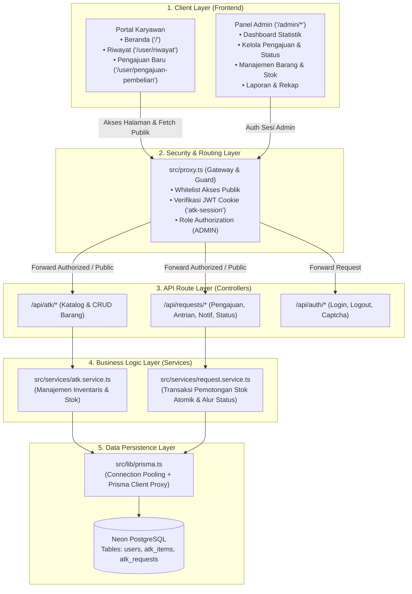
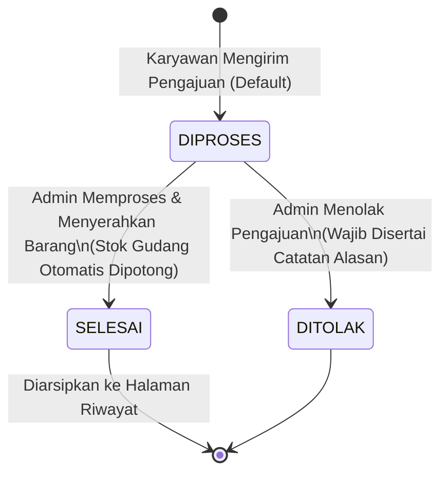

# 🏛️ Arsitektur Sistem Pengajuan ATK

Dokumen ini menyajikan arsitektur teknis dari aplikasi **Sistem Pengajuan ATK (Hasamitra Jabar)** berbasis **Next.js 16 (App Router)**. Dokumen dirancang ringkas, menyeluruh, serta berfokus pada alur sistem dan **file-file penting yang sering dikonfigurasi**.

---

## 1. Stack Teknologi & Pola Arsitektur

Aplikasi mengadopsi pola **Layered Architecture (Arsitektur Berlapis)**:

| Lapisan | Teknologi / Pustaka | Fungsi Utama |
|---|---|---|
| **Frontend Framework** | **Next.js 16.3.1 (App Router)** & **React 19** | Server/Client Components, file-based routing |
| **Styling & UI** | **Tailwind CSS v4** | Utility-first styling modern & responsive |
| **Security & Routing Guard** | **`src/proxy.ts`** & **`jose` (JWT)** | Proteksi rute admin, whitelist public API, URL redirection |
| **ORM & Database** | **Prisma v7** + **Neon Serverless PostgreSQL** | Manajemen skema data, migrasi, dan pool adapter (`@prisma/adapter-pg`) |
| **Validasi & Utilitas** | **Zod** & **xlsx** | Validasi payload request dan ekspor data excel |



---

## 2. File-File Penting & Panduan Konfigurasi

Berikut berkas utama yang paling sering diperiksa atau dikonfigurasi saat pemeliharaan dan pengembangan fitur baru:

### ⚙️ 1. [`.env`](file:///d:/Project/Code/NextJs/Hasamitra/Alat%20Tulis%20Kantor/.env) — *Environment Variables*
Menyimpan kredensial penting lingkungan runtime aplikasi:
* `DATABASE_URL`: String koneksi PostgreSQL Neon dengan mode pooler (`sslmode=verify-full`).
* `AUTH_SECRET`: Kunci enkripsi verifikasi JWT token untuk sesi admin.
* `ADMIN_EMAIL` & `ADMIN_PASSWORD`: Akun default saat inisialisasi basis data (`db:seed`).

### 🛡️ 2. [`src/proxy.ts`](file:///d:/Project/Code/NextJs/Hasamitra/Alat%20Tulis%20Kantor/src/proxy.ts) — *Middleware & Security Gateway*
Pusat kontrol penjaga akses seluruh rute di aplikasi (menggantikan middleware lama):
* **Public Frontend Pages**: Rute halaman yang boleh dibuka siapapun tanpa login (`/`, `/user/riwayat`, `/user/pengajuan-pembelian`, `/admin/login`).
* **Public API Endpoints**: Endpoint data yang dapat diakses publik (`/api/atk` [GET], `/api/requests` [GET/POST], `/api/requests/portal-notifications` [GET]).
* **Protected Routes**: Rute yang wajib menyertakan cookie JWT admin valid (`/admin/*` dan administrative API).

> [!IMPORTANT]
> Jika Anda menambahkan halaman publik baru atau endpoint API baru untuk portal karyawan, **wajib mendaftarkannya di `src/proxy.ts`**, agar tidak dicegat error `401 Unauthorized`.

### 🗃️ 3. [`prisma/schema.prisma`](file:///d:/Project/Code/NextJs/Hasamitra/Alat%20Tulis%20Kantor/prisma/schema.prisma) — *Database Schema & Model*
Definisi skema tabel, relasi, dan enum:
* **`User`**: Data pengguna (karyawan pemohon atau admin).
* **`AtkItem`**: Katalog barang inventaris fisik dan kuantitas stok.
* **`AtkRequest`**: Riwayat pengajuan barang.
* **`RequestStatus`**: Siklus hidup status pengajuan (**`DIPROSES`**, **`DITOLAK`**, **`SELESAI`**).

### 🔌 4. [`src/lib/prisma.ts`](file:///d:/Project/Code/NextJs/Hasamitra/Alat%20Tulis%20Kantor/src/lib/prisma.ts) — *Database Client Singleton*
* Menggunakan `@prisma/adapter-pg` dan koneksi `Pool` dari package `pg`.
* Dibungkus dengan `Proxy` singleton untuk mencegah kehabisan koneksi (*connection exhaustion*) saat dieksekusi di lingkungan serverless seperti Vercel.

### 🔑 5. [`src/lib/session.ts`](file:///d:/Project/Code/NextJs/Hasamitra/Alat%20Tulis%20Kantor/src/lib/session.ts) — *JWT Session Manager*
Mengatur enkripsi, penulisan cookie HTTP-only (`atk-session`), dan verifikasi identitas sesi administrator.

### ⚡ 6. [`src/services/request.service.ts`](file:///d:/Project/Code/NextJs/Hasamitra/Alat%20Tulis%20Kantor/src/services/request.service.ts) — *Core Business Logic*
Mengatur transaksi atomik database (`prisma.$transaction`):
* Memastikan saat status pengajuan diubah menjadi **`SELESAI`**, stok barang di gudang otomatis terpotong secara aman.
* Mengembalikan stok kembali jika terjadi pembatalan/penolakan.

---

## 3. Struktur Direktori Proyek (Terbaru)

```text
src/
├── app/
│   ├── page.tsx                             # Beranda Utama (Katalog Stok & Antrian Pengajuan)
│   ├── layout.tsx                           # Root Layout (Font, Metadata, ToastProvider)
│   ├── user/
│   │   ├── riwayat/page.tsx                 # Riwayat Pengajuan Selesai (Khusus Karyawan)
│   │   └── pengajuan-pembelian/page.tsx     # Form Usulan Pengadaan ATK Baru
│   ├── admin/
│   │   ├── login/page.tsx                   # Halaman Login Khusus Administrator
│   │   ├── dashboard/page.tsx               # Dashboard Ringkasan & Monitoring Admin
│   │   ├── pengajuan/                       # Manajemen Seluruh Pengajuan ([id] detail & status)
│   │   ├── barang/page.tsx                  # Master Data Katalog Barang
│   │   ├── stok/page.tsx                    # Monitoring & Penyesuaian Stok Fisik
│   │   └── laporan/page.tsx                 # Rekapitulasi Laporan & Ekspor Excel
│   └── api/                                 # Route Handlers (REST API Endpoints)
│       ├── atk/                             # GET katalog, POST/DELETE barang
│       ├── requests/                        # Submit pengajuan, antrian, purchase, stats, report
│       └── auth/                            # Login, logout, captcha
├── components/
│   ├── dashboard/                           # Komponen Modular Halaman Beranda
│   │   ├── DashboardHeader.tsx              # Header sambutan, jam kerja, search & notif
│   │   ├── StockCatalogCard.tsx             # Kartu katalog stok barang ATK
│   │   ├── QueueListCard.tsx                # Kartu daftar antrian berkas ATK
│   │   ├── PengajuanAtkModal.tsx            # Modal formulir pengajuan barang
│   │   ├── FastTrackModal.tsx               # Integrasi direct link ke Telegram Admin
│   │   └── StatusBadges.tsx                 # Label status visual terpadu
│   ├── layout/
│   │   ├── Sidebar.tsx                      # Navigasi utama dengan rasio logo 6:1
│   │   └── NotificationDropdown.tsx         # Dropdown notifikasi dengan mutex polling guard
│   └── ui/                                  # Komponen atomik (Button, Modal, Toast, Table, Card)
├── lib/                                     # Utility & Konfigurasi Backend
│   ├── prisma.ts                            # Koneksi adapter Prisma Client
│   ├── session.ts                           # JWT auth & cookie reader
│   ├── validation.ts                        # Skema validasi Zod
│   └── notificationSound.ts                 # Pemutar audio notifikasi real-time
├── services/                                # Business Logic & Database Queries
│   ├── atk.service.ts                       # Logika inventaris barang
│   └── request.service.ts                   # Logika pengajuan & transaksi stok
└── proxy.ts                                 # Next.js 16 Gateway Guard / Middleware
```

---

## 4. Alur Transaksi & State Machine Status

### A. Status Pengajuan (`RequestStatus`)
Alur status disederhanakan menjadi **3 status utama**:



### B. Distribusi Tampilan Beranda vs Riwayat
* **Antrian di Beranda (`/`)**: Menampilkan pengajuan dengan status `DIPROSES`, serta pengajuan `SELESAI` khusus pada hari berjalan.
* **Halaman Riwayat (`/user/riwayat`)**: Menampung arsip permanen seluruh pengajuan yang telah `SELESAI` dengan filter tanggal dan pencarian.

---

## 5. Sinkronisasi Data Real-Time & Caching Production

Untuk memastikan data antrian tidak tertahan oleh edge cache di hosting (seperti Vercel):
1. **Header Anti-Caching**: Endpoint [`/api/requests/portal-notifications`](file:///d:/Project/Code/NextJs/Hasamitra/Alat%20Tulis%20Kantor/src/app/api/requests/portal-notifications/route.ts) menerapkan header:
   ```http
   Cache-Control: no-store, no-cache, must-revalidate, max-age=0
   ```
2. **Client Fetch Policy**: Fetching di `page.tsx` menggunakan opsi `cache: "no-store"` dan query parameter `_t=Date.now()`.
3. **Concurrency Guard**: Komponen notifikasi menggunakan ref `isFetchingRef` untuk mencegah request bertabrakan yang memicu error network.
