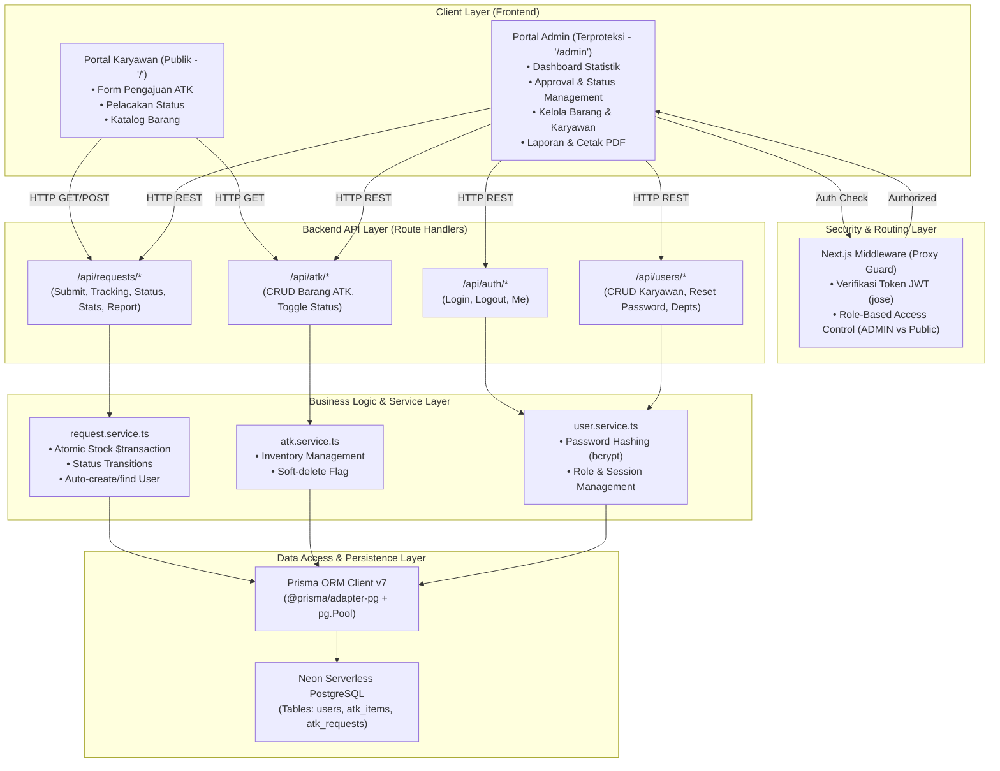
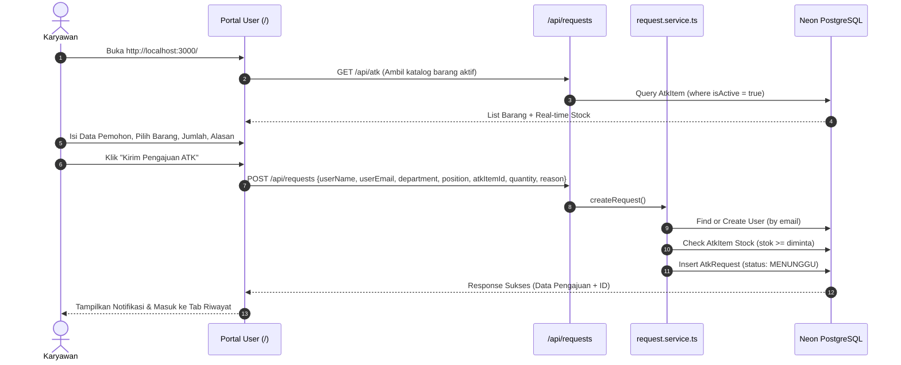
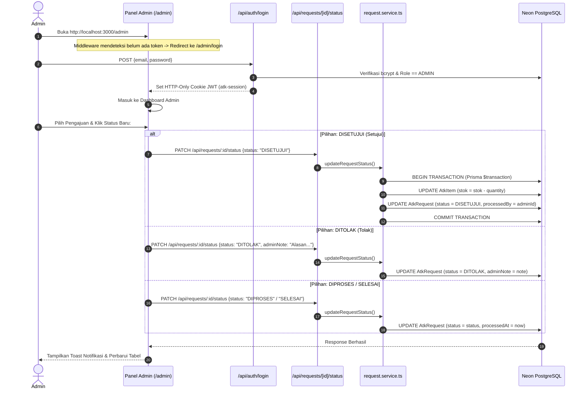
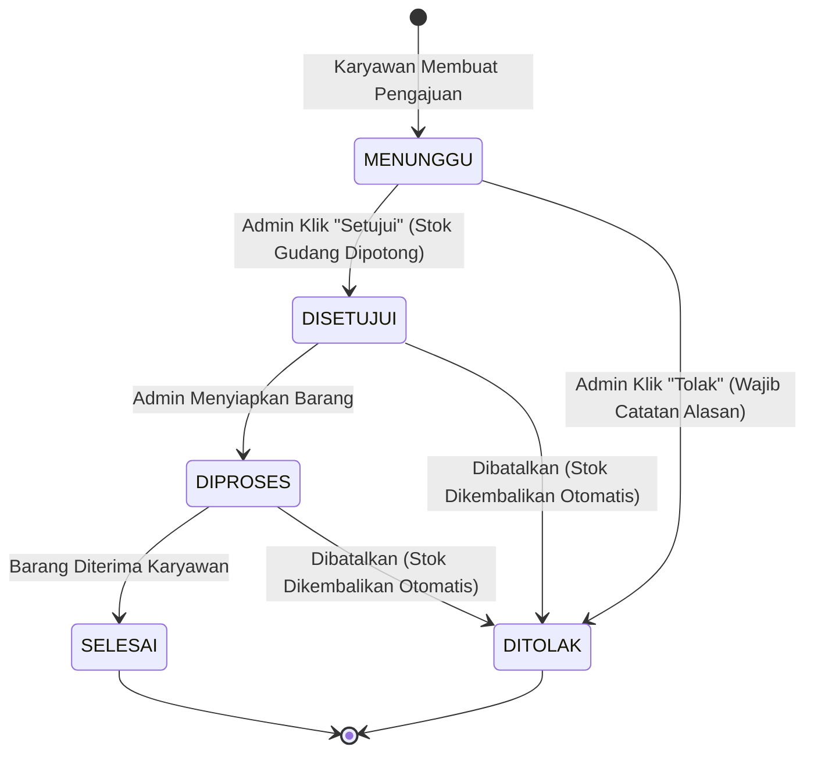
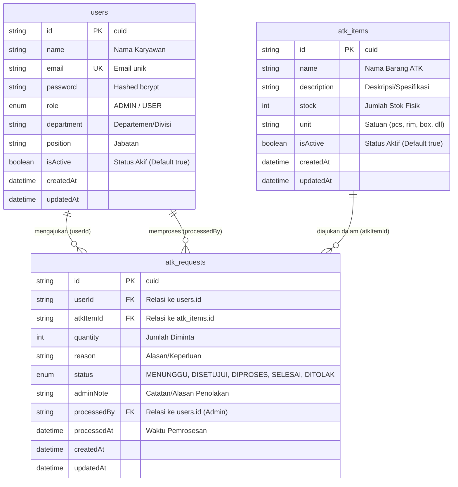

# Dokumentasi Arsitektur Sistem Pengajuan ATK

Dokumen ini menjelaskan rancangan arsitektur, diagram aliran data, model basis data, mekanisme transaksi, dan pola desain sistem pada aplikasi **Sistem Pengajuan ATK (Alat Tulis Kantor)**.

---

## 1. Ikhtisar Arsitektur Sistem

Aplikasi dibangun menggunakan pola **Layered Architecture (Arsitektur Berlapis)** berbasis framework **Next.js App Router**, **TypeScript**, **Prisma ORM**, dan **Neon Serverless PostgreSQL**.



---

## 2. Diagram Alur Transaksi Pengajuan

### A. Alur Karyawan (Public Submission & Tracking)
Karyawan dapat langsung mengakses portal tanpa perlu melakukan proses login:



---

### B. Alur Peninjauan Administrator & Manajemen Status
Administrator mengakses URL khusus `/admin` untuk meninjau pengajuan dan memberikan keputusan:



---

## 3. Diagram State Machine Status Pengajuan

Sistem mendukung 5 status pengajuan dengan aturan transisi yang terkelola:



---

## 4. Model Entity Relationship (ERD)



---

## 5. Komponen & Struktur Direktori

```text
src/
├── app/
│   ├── page.tsx                         # Portal Karyawan Publik (Form, Status, Katalog)
│   ├── layout.tsx                       # Root Layout HTML + ToastProvider + Inter Font
│   ├── admin/
│   │   ├── login/page.tsx               # Login Khusus Administrator
│   │   ├── dashboard/page.tsx           # Dashboard Admin & Quick Status Review
│   │   ├── pengajuan/                   # Manajemen Pengajuan & Filter Lengkap
│   │   │   ├── page.tsx
│   │   │   └── [id]/page.tsx            # Detail Audit & Ubah Status
│   │   ├── barang/page.tsx              # CRUD Barang ATK & Stok
│   │   ├── karyawan/page.tsx            # CRUD Data Karyawan & Reset Password
│   │   └── laporan/page.tsx             # Analisis Rekapitulasi & Ekspor PDF
│   └── api/                             # REST API Route Handlers
│       ├── auth/login, logout, me       # Manajemen Autentikasi
│       ├── atk/                         # Data Barang ATK
│       ├── requests/                    # Transaksi Pengajuan, Stats, Laporan
│       └── users/                       # Data Karyawan & Departemen
├── components/
│   ├── ui/                              # Button, Input, Select, Textarea, Card, Badge, Modal, Table, Toast
│   └── layout/                          # Navbar, Sidebar, AdminLayout
├── lib/
│   ├── prisma.ts                        # PostgreSQL Pooler & Prisma Adapter
│   ├── auth.ts                          # JWT Token & Bcrypt Hashing
│   ├── session.ts                       # Cookie Session Reader & Guard
│   └── validation.ts                    # Zod Schemas
├── services/                            # Business Logic Services
│   ├── request.service.ts               # Transaksi Pengajuan & Stok Atomik
│   ├── atk.service.ts                   # Manajemen Persediaan Barang
│   └── user.service.ts                  # Manajemen Pengguna
└── middleware.ts                        # Route Protection & Role Verification
```
