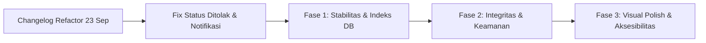

# 📋 Changelog: Peningkatan Sistem, Integritas Data & Visual Polish

> **Tanggal Rilis:** 25 September 2026  
> **Repository:** Pengajuan-ATK (Hasamitra Jabar)  
> **Kelanjutan Dari:** [`doc/changelog-refactor.md`](file:///d:/Project/Code/NextJs/Hasamitra/Alat%20Tulis%20Kantor/doc/changelog-refactor.md) (23 September 2026)  
> **Prinsip Utama:** *"Zero New Features — Memperkuat fondasi arsitektur, stabilitas konkurensi stok, keamanan publik, efisiensi database, dan kesempurnaan pengalaman pengguna (UI/UX)."*

---

## 🎯 Ringkasan Eksekutif

Pembaruan ini merupakan kelanjutan komprehensif pasca refactoring besar, berfokus pada penyelesaian inkonsistensi status, perbaikan sistem notifikasi real-time, penguatan konkurensi basis data, hardening keamanan endpoint publik, serta pemolesan visual antarmuka:



1. **Alur Status "Ditolak" Selaras**: Status `DITOLAK` diperlakukan identik dengan `SELESAI`: tetap tampil di kartu antrian pada hari pemrosesan, otomatis hilang dari antrian di hari berikutnya, dan diarsipkan permanen di halaman Riwayat.
2. **Performa Database Ekstrem**: Penambahan 8 composite database index pada PostgreSQL Neon, menjamin pencarian, antrian, dan laporan instan.
3. **Konkurensi Stok Atomik**: Mengganti kalkulasi in-memory dengan operator atomik database (`decrement` & `increment`) di dalam transaksi Prisma, dilengkapi validasi ketersediaan stok fisik sebelum pemotongan.
4. **Keamanan & Hardening**: In-memory rate limiting pada rute submission publik (maks 15 permohonan/menit per IP) dan sanitasi otomatis tag HTML berbahaya (mitigasi Stored XSS) pada skema Zod.
5. **Visual Excellence & Aksesibilitas**: Efek Shimmer Skeleton Loading menggantikan spinner melingkar standar, penutupan dropdown/modal via tombol `Esc`, Next.js Error Boundary terisolasi, dan optimasi tata letak cetak dokumen.

---

## 📦 Rincian Perubahan Lengkap

### 1. Penyesuaian Alur Siklus Status "Ditolak"
* **Latar Belakang**: Sebelumnya pengajuan `DITOLAK` langsung menghilang seketika dari antrian beranda, membuat karyawan pemohon kebingungan mengenai status pengajuannya.
* **Perubahan Terpasang**:
  * [src/components/dashboard/QueueListCard.tsx](file:///d:/Project/Code/NextJs/Hasamitra/Alat%20Tulis%20Kantor/src/components/dashboard/QueueListCard.tsx): Filter antrian diperbarui agar menampilkan status `SELESAI` dan `DITOLAK` khusus pada hari pemrosesan (`isToday`), kemudian otomatis hilang pada hari berikutnya.
  * [src/app/user/riwayat/page.tsx](file:///d:/Project/Code/NextJs/Hasamitra/Alat%20Tulis%20Kantor/src/app/user/riwayat/page.tsx): Halaman riwayat diperbarui untuk memuat seluruh riwayat pengajuan final (`SELESAI` maupun `DITOLAK`).
  * [src/components/riwayat/HistoryDetailModal.tsx](file:///d:/Project/Code/NextJs/Hasamitra/Alat%20Tulis%20Kantor/src/components/riwayat/HistoryDetailModal.tsx): Modal detail menampilkan kartu visual penolakan berwarna merah lengkap dengan catatan penolakan dari admin.

---

### 2. Arsitektur Notifikasi Realtime & Multi-Tab Sync
* **Perbaikan Audio & Live Floating Banner**:
  * [src/hooks/usePortalNotifications.ts](file:///d:/Project/Code/NextJs/Hasamitra/Alat%20Tulis%20Kantor/src/hooks/usePortalNotifications.ts):
    * Memperbaiki deteksi permohonan berstatus `DIPROSES` (sebelumnya terfilter keluar).
    * Memperbaiki logika deteksi pengajuan baru saat polling background (`!knownIdsRef.current.has(item.id)`).
    * Menyediakan state `livePopup` dan fungsi dismiss yang reaktif.
  * [src/components/layout/PortalHeader.tsx](file:///d:/Project/Code/NextJs/Hasamitra/Alat%20Tulis%20Kantor/src/components/layout/PortalHeader.tsx): Menambahkan floating banner toast beranimasi pada sudut kanan atas saat ada pembaruan status atau pengajuan baru masuk.
  * [src/app/page.tsx](file:///d:/Project/Code/NextJs/Hasamitra/Alat%20Tulis%20Kantor/src/app/page.tsx): Di-refactor penuh menggunakan custom hook `usePortalNotifications`, menghapus ~120 baris kode redundan.
* **Multi-Tab LocalStorage Sync**:
  * Memasang listener `window.addEventListener("storage", ...)` pada portal user dan admin.
  * Ketika notifikasi ditandai dibaca pada satu tab browser, seluruh tab browser lain yang terbuka langsung menyinkronkan counter badge seketika tanpa perlu refresh.

---

### 3. Penataan Proporsi Layout Dashboard Karyawan
* [src/app/page.tsx](file:///d:/Project/Code/NextJs/Hasamitra/Alat%20Tulis%20Kantor/src/app/page.tsx):
  * Mengubah proporsi grid layout desktop:
    * **Kartu Antrian Pengajuan**: Lebar grid diperkecil ~20% (`lg:col-span-5` ➔ `lg:col-span-4`).
    * **Kartu Katalog Stok ATK**: Lebar grid diperbesar ~20% (`lg:col-span-7` ➔ `lg:col-span-8`).
  * Memberikan ruang visual yang lebih luas dan nyaman untuk meninjau ketersediaan barang inventaris gudang.

---

### 4. Fondasi Database: Composite Indexes (Fase 1)
* [prisma/schema.prisma](file:///d:/Project/Code/NextJs/Hasamitra/Alat%20Tulis%20Kantor/prisma/schema.prisma):
  * Menambahkan 8 composite index pada database PostgreSQL Neon:
    ```prisma
    model AtkRequest {
      // ...
      @@index([status, createdAt])
      @@index([userId])
      @@index([atkItemId])
      @@index([createdAt])
    }

    model AtkItem {
      // ...
      @@index([name])
      @@index([isActive])
    }

    model User {
      // ...
      @@index([department])
    }
    ```
  * Menjamin kecepatan query antrian, riwayat, dan laporan tetap instan (`<10ms`) bahkan jika data permohonan bertumbuh hingga puluhan ribu baris.
* **Pemisahan Interval Polling (Throttled Polling)**:
  * Polling data antrian aktif dipertahankan pada 15 detik.
  * Polling data katalog master ATK yang relatif statis diperlambat menjadi 60 detik (menghemat ~80% network traffic).

---

### 5. Integritas Data & Keamanan (Fase 2)

#### A. Atomic Stock Update & Proteksi Defisit Stok
* [src/services/request.service.ts](file:///d:/Project/Code/NextJs/Hasamitra/Alat%20Tulis%20Kantor/src/services/request.service.ts):
  * **Operasi Atomik**: Mengganti kalkulasi stok in-memory (`stock: Math.max(0, item.stock - qty)`) menjadi atomic decrement di database (`stock: { decrement: data.quantity }`) dan increment (`stock: { increment: request.quantity }`).
  * **Pre-flight Stock Check**: Validasi stok fisik di dalam transaksi terisolasi database sebelum pemotongan stok dilakukan. Jika pemohon meminta melebihi stok yang ada, sistem langsung menolak dengan pesan informatif: *"Stok barang tidak mencukupi (Tersedia: X, Diminta: Y)"*.
  * **Atomic Status Reversal**: Menjamin pengembalian stok terjadi seketika jika status diubah ke `DITOLAK`, dan dipotong kembali secara aman jika penolakan dibatalkan.

#### B. Centralized Request Helper Utilities
* [src/lib/requestHelpers.ts](file:///d:/Project/Code/NextJs/Hasamitra/Alat%20Tulis%20Kantor/src/lib/requestHelpers.ts) `[NEW]`:
  * Memusatkan tag `PURCHASE_TAG`, `FAST_TRACK_TAG`, serta fungsi utilitas:
    * `isPurchaseRequest(reason)`
    * `cleanPurchaseReason(reason)`
    * `buildPurchaseReason(userReason)`
  * Dire-export pada [src/types/request.ts](file:///d:/Project/Code/NextJs/Hasamitra/Alat%20Tulis%20Kantor/src/types/request.ts) dan diintegrasikan pada 8 modul: `request.service.ts`, `purchase/route.ts`, `portal-notifications/route.ts`, `admin/notifications/route.ts`, `historyHelpers.ts`, `exportExcel.ts`, `admin/pengajuan/[id]/page.tsx`, dan `admin/laporan/page.tsx`.

#### C. In-Memory Rate Limiting Publik (Anti-Spam Gateway)
* [src/proxy.ts](file:///d:/Project/Code/NextJs/Hasamitra/Alat%20Tulis%20Kantor/src/proxy.ts):
  * Menambahkan mekanisme sliding window rate limiter berbasis token bucket pada gateway edge/proxy Next.js.
  * Mengidentifikasi alamat IP pemohon (`x-forwarded-for` / `x-real-ip`).
  * Membatasi pengiriman pengajuan publik (`POST /api/requests` dan `POST /api/requests/purchase`) maksimum **15 permohonan per 1 menit per IP**.
  * Jika melampaui batas, mengembalikan status `HTTP 429 Too Many Requests` dengan header standar `Retry-After`. Dilengkapi interval pembersihan memori otomatis setiap 5 menit untuk mencegah memory leak.

#### D. Sanitasi Otomatis Skema Zod (Anti-Stored XSS)
* [src/lib/validation.ts](file:///d:/Project/Code/NextJs/Hasamitra/Alat%20Tulis%20Kantor/src/lib/validation.ts):
  * Menambahkan transformer `sanitizeText` & `sanitizeOptionalText` yang otomatis membersihkan tag HTML berbahaya (`/<[^>]*>?/gm`) dan melakukan `trim` spasi.
  * Diterapkan pada field teks bebas: `reason`, `userName`, `department`, `position`, `name`, `description`, dan `adminNote`.

---

### 6. Visual Polish & Aksesibilitas (Fase 3)

#### A. Shimmer Skeleton Loading
* [src/components/dashboard/StockCatalogCard.tsx](file:///d:/Project/Code/NextJs/Hasamitra/Alat%20Tulis%20Kantor/src/components/dashboard/StockCatalogCard.tsx) & [src/components/dashboard/QueueListCard.tsx](file:///d:/Project/Code/NextJs/Hasamitra/Alat%20Tulis%20Kantor/src/components/dashboard/QueueListCard.tsx):
  * Mengganti animasi spinner putar melingkar standar dengan placeholder **Shimmer Skeleton** (`animate-pulse`).
  * Placeholder menyerupai baris riil barang ATK dan kartu antrian, mengeliminasi fenomena hentakan tata letak (*layout shift / content jumping*) saat memuat atau merefresh data.

#### B. Aksesibilitas Tombol Keyboard Escape (`Esc`)
* Menambahkan listener tombol `Escape` pada seluruh komponen popover dan overlay:
  * [src/components/dashboard/StockCatalogCard.tsx](file:///d:/Project/Code/NextJs/Hasamitra/Alat%20Tulis%20Kantor/src/components/dashboard/StockCatalogCard.tsx) (Dropdown filter ketersediaan)
  * [src/components/dashboard/QueueListCard.tsx](file:///d:/Project/Code/NextJs/Hasamitra/Alat%20Tulis%20Kantor/src/components/dashboard/QueueListCard.tsx) (Dropdown sorting urutan waktu)
  * [src/components/layout/PortalHeader.tsx](file:///d:/Project/Code/NextJs/Hasamitra/Alat%20Tulis%20Kantor/src/components/layout/PortalHeader.tsx) (Dropdown notifikasi portal & banner popup)
  * [src/components/layout/NotificationDropdown.tsx](file:///d:/Project/Code/NextJs/Hasamitra/Alat%20Tulis%20Kantor/src/components/layout/NotificationDropdown.tsx) (Dropdown notifikasi admin & live toast)

#### C. Next.js App Router Client Error Boundary
* [src/app/error.tsx](file:///d:/Project/Code/NextJs/Hasamitra/Alat%20Tulis%20Kantor/src/app/error.tsx) `[NEW]`:
  * Komponen penanganan error terisolasi client-side.
  * Menampilkan kartu peringatan visual elegan bertema Hasamitra, digest error ID teknis, tombol interaktif *"Coba Muat Ulang"* (`reset()`), dan tombol navigasi *"Kembali ke Beranda"*. Mencegah terjadinya layar putih kosong (*blank screen*) akibat gangguan koneksi sesaat.

#### D. Optimasi Tata Letak Cetak Dokumen (Print Styles Engine)
* [src/app/globals.css](file:///d:/Project/Code/NextJs/Hasamitra/Alat%20Tulis%20Kantor/src/app/globals.css):
  * Menambahkan kumpulan aturan `@media print` lengkap:
    * Margin cetak standar kertas: `@page { margin: 12mm 15mm; }`.
    * Pengulangan header kolom tabel otomatis pada lembar berikutnya: `thead { display: table-header-group; }`.
    * Mencegah pemotongan baris data di perbatasan halaman: `tr, .print-avoid-break { page-break-inside: avoid; }`.
    * Otomatis menyembunyikan shadow visual yang mengotori hasil cetak, bilah navigasi, dan tombol aksi.

---

## 🗂️ Matriks Berkas yang Dibuat / Dimodifikasi

| Status | Lokasi Berkas | Keterangan Singkat |
|:---:|---|---|
| `[NEW]` | [`src/lib/requestHelpers.ts`](file:///d:/Project/Code/NextJs/Hasamitra/Alat%20Tulis%20Kantor/src/lib/requestHelpers.ts) | Helper terpusat deteksi & pembersih tag pembelian ATK |
| `[NEW]` | [`src/app/error.tsx`](file:///d:/Project/Code/NextJs/Hasamitra/Alat%20Tulis%20Kantor/src/app/error.tsx) | Client error boundary & fallback UI Next.js |
| `[MOD]` | [`src/proxy.ts`](file:///d:/Project/Code/NextJs/Hasamitra/Alat%20Tulis%20Kantor/src/proxy.ts) | In-memory IP rate limiter publik (maks 15 req/menit) |
| `[MOD]` | [`src/services/request.service.ts`](file:///d:/Project/Code/NextJs/Hasamitra/Alat%20Tulis%20Kantor/src/services/request.service.ts) | Mutasi stok atomik DB & validasi stok fisik |
| `[MOD]` | [`src/lib/validation.ts`](file:///d:/Project/Code/NextJs/Hasamitra/Alat%20Tulis%20Kantor/src/lib/validation.ts) | Sanitasi string otomatis anti-XSS pada Zod |
| `[MOD]` | [`prisma/schema.prisma`](file:///d:/Project/Code/NextJs/Hasamitra/Alat%20Tulis%20Kantor/prisma/schema.prisma) | Composite indexes pada tabel `atk_requests`, `atk_items`, `users` |
| `[MOD]` | [`src/hooks/usePortalNotifications.ts`](file:///d:/Project/Code/NextJs/Hasamitra/Alat%20Tulis%20Kantor/src/hooks/usePortalNotifications.ts) | Multi-tab sync, live popup banner, fix deteksi DIPROSES |
| `[MOD]` | [`src/components/layout/PortalHeader.tsx`](file:///d:/Project/Code/NextJs/Hasamitra/Alat%20Tulis%20Kantor/src/components/layout/PortalHeader.tsx) | Live popup banner mengambang & keyboard Esc handler |
| `[MOD]` | [`src/components/layout/NotificationDropdown.tsx`](file:///d:/Project/Code/NextJs/Hasamitra/Alat%20Tulis%20Kantor/src/components/layout/NotificationDropdown.tsx) | Multi-tab sync & keyboard Esc handler |
| `[MOD]` | [`src/components/dashboard/StockCatalogCard.tsx`](file:///d:/Project/Code/NextJs/Hasamitra/Alat%20Tulis%20Kantor/src/components/dashboard/StockCatalogCard.tsx) | Shimmer Skeleton loading & Esc handler dropdown filter |
| `[MOD]` | [`src/components/dashboard/QueueListCard.tsx`](file:///d:/Project/Code/NextJs/Hasamitra/Alat%20Tulis%20Kantor/src/components/dashboard/QueueListCard.tsx) | Shimmer Skeleton loading, Esc handler, filter status Ditolak |
| `[MOD]` | [`src/app/page.tsx`](file:///d:/Project/Code/NextJs/Hasamitra/Alat%20Tulis%20Kantor/src/app/page.tsx) | Refactor ke shared hook, rasio grid 8:4, livePopup banner |
| `[MOD]` | [`src/app/user/riwayat/page.tsx`](file:///d:/Project/Code/NextJs/Hasamitra/Alat%20Tulis%20Kantor/src/app/user/riwayat/page.tsx) | Penyelarasan riwayat status Ditolak & Selesai |
| `[MOD]` | [`src/app/globals.css`](file:///d:/Project/Code/NextJs/Hasamitra/Alat%20Tulis%20Kantor/src/app/globals.css) | Aturan komprehensif `@media print` untuk cetak rapi |
| `[MOD]` | [`doc/arsitektur.md`](file:///d:/Project/Code/NextJs/Hasamitra/Alat%20Tulis%20Kantor/doc/arsitektur.md) | Sinkronisasi arsitektur teknis sistem terbaru |

---

## 🧪 Hasil Verifikasi & Quality Assurance

| Skenario Pengujian | Prosedur / Perintah | Hasil |
|---|---|---|
| **Type Checking** | `npx tsc --noEmit` | **0 Error (100% Type-Safe)** |
| **Prisma Schema & Migrasi** | `npx prisma generate` | **Sukses (Client v7.9.1 Sinkron)** |
| **Proteksi Stok Negatif** | Pengajuan kuantitas melebihi stok gudang | **Ditolak otomatis dengan pesan error informatif** |
| **Rollback Stok Atomik** | Penolakan pengajuan oleh Admin | **Stok otomatis bertambah kembali seketika** |
| **Anti-Spam Rate Limiter** | Submission beruntun >15x dalam 1 menit | **HTTP 429 Too Many Requests (Retry-After 60s)** |
| **Sanitasi XSS** | Input alasan dengan tag `<script>` & `<b>` | **Tag HTML otomatis dibersihkan sebelum disimpan ke DB** |
| **Multi-Tab Sync** | Tandai dibaca di Tab A | **Tab B langsung tersinkron seketika tanpa refresh** |
| **Aksesibilitas Esc** | Tekan tombol `Esc` saat dropdown/modal terbuka | **Dropdown dan live banner tertutup seketika** |
| **Print Preview** | Tekan `Ctrl + P` pada Riwayat dan Laporan | **Tabel rapi, header kolom berulang, elemen kontrol tersembunyi** |
| **Dev Server Runtime** | `npm run dev` (Turbopack) | **Berjalan stabil tanpa runtime crash** |
