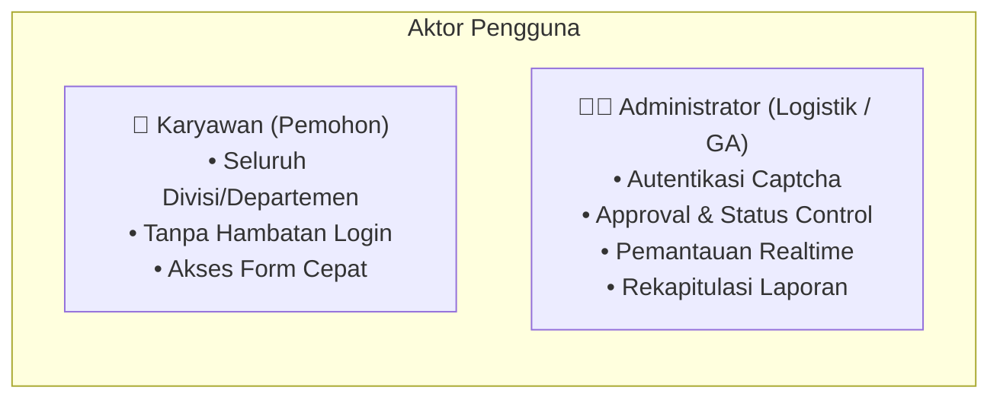
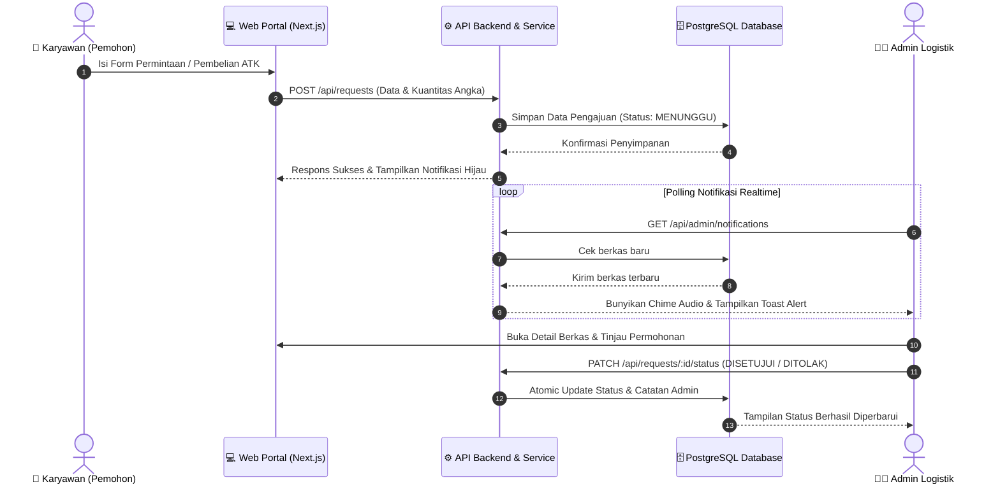
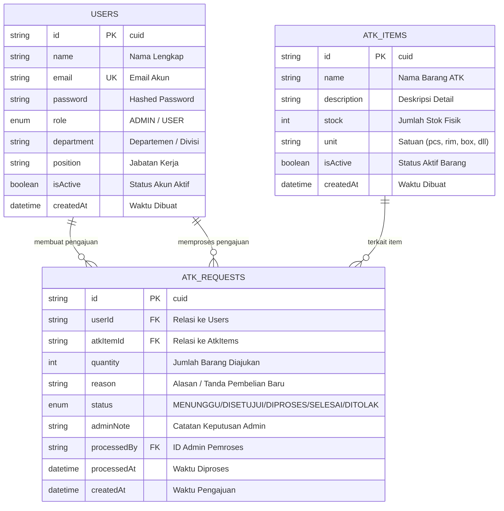

# Product Requirement Document (PRD)
## Sistem Informasi Pengajuan Alat Tulis Kantor (ATK) - PT Hasamitra Bersama

---

### Informasi Dokumen (Document Control)

| Parameter | Keterangan |
| :--- | :--- |
| **Nama Proyek** | Sistem Informasi Pengajuan ATK (Web-ATK) |
| **Instansi / Perusahaan** | PT Hasamitra Bersama |
| **Versi Dokumen** | 2.0.0 (Production Release) |
| **Status Dokumen** | Disetujui & Siap Produksi (*Approved*) |
| **Terakhir Diperbarui** | Agustus 2026 |
| **Platform** | Web Application (Responsive: Desktop, Tablet, Mobile) |
| **Teknologi Utama** | Next.js App Router (TypeScript), Prisma ORM v7, PostgreSQL (Neon Serverless), Tailwind CSS |

---

## 1. Latar Belakang & Pernyataan Masalah

### 1.1 Latar Belakang
Pengelolaan inventaris dan permohonan Alat Tulis Kantor (ATK) di lingkungan **PT Hasamitra Bersama** merupakan proses operasional rutin yang melibatkan seluruh divisi/departemen kerja. Karyawan secara berkala membutuhkan suplai barang ATK yang tersedia di gudang serta mengajukan pengadaan barang ATK baru yang belum tersedia dalam inventaris.

### 1.2 Masalah yang Dihadapi (Problem Statements)
1. **Pencatatan Manual yang Rentan Kesalahan**: Pengajuan menggunakan formulir kertas atau chat manual berisiko tinggi terhadap kehilangan berkas, pencatatan ganda, dan sulitnya penelusuran status.
2. **Ketiadaan Pemisahan Jenis Pengajuan**: Tidak adanya sistem yang memisahkan secara tegas antara *permintaan stok barang yang sudah ada di gudang* dengan *permohonan pembelian barang baru*, sehingga menyulitkan admin logistik dalam prioritas kerja.
3. **Keterlambatan Penanganan & Kurangnya Notifikasi Realtime**: Admin terlambat mengetahui adanya pengajuan mendesak karena tidak ada sistem pemantau aktif dengan alarm notifikasi audio dan visual.
4. **Rekapitulasi Laporan Bulanan yang Lambat**: Pembuatan laporan manual memerlukan waktu lama dan rawan terjadi ketidaksesuaian data antara jumlah pemohon dan kuantitas barang yang dikeluarkan.

---

## 2. Tujuan Produk & Indikator Keberhasilan (Goals & KPIs)

### 2.1 Tujuan Produk
- Menyediakan **Portal Karyawan Terpadu** yang cepat, tanpa login berbelit, untuk mengajukan permohonan ATK reguler maupun pengadaan pembelian barang baru.
- Menyediakan **Portal Admin Terproteksi** dengan panel approval, kontrol inventaris otomatis (*atomic transaction*), notifikasi realtime, dan laporan data ekspor CSV.
- Menyediakan jalur komunikasi cepat (*Fast Track Support*) melalui integrasi Telegram CS langsung dari sistem.

### 2.2 Indikator Keberhasilan (Success Metrics / KPIs)
- **Efisiensi Waktu Pengajuan**: Memangkas waktu proses pengajuan dari rata-rata 1-2 hari kerja menjadi hitungan menit.
- **Akurasi Data Inventaris**: 100% akurasi pencatatan kuantitas barang keluar dan masuk berkat mekanisme transaksi atomik database.
- **Waktu Respons Admin**: Peningkatan kecepatan respons persetujuan berkas berkat fitur *Realtime Sound Alert & Banner Notification*.
- **Kemudahan Pelaporan**: Pembuatan laporan berkala (*weekly/monthly*) dapat diekspor secara instan ke format `.csv` berstandar internasional (*UTF-8 BOM*).

---

## 3. Pengguna Sasaran & Persona (User Personas)

| Persona | Peran & Tanggung Jawab | Kebutuhan Utama |
| :--- | :--- | :--- |
| **Karyawan (Pemohon)** | Mengajukan kebutuhan ATK harian divisi atau pengadaan barang baru untuk menunjang pekerjaan operasional. | Form input yang simpel, kolom kuantitas fleksibel khusus angka, feedback instan pengiriman berkas, dan tombol fast-track bantuan. |
| **Administrator (Logistik/GA)** | Memverifikasi kelayakan pengajuan, menyetujui/menolak, mengelola inventaris, dan membuat laporan pertanggungjawaban. | Dashboard pemantau terpisah, alarm notifikasi realtime, pencarian & filter data, serta tombol ekspor laporan CSV rapi. |

---

## 4. Ruang Lingkup Produk & Fitur Utama

### 4.1 Modul Portal Karyawan (`/`)
1. **Formulir Permintaan ATK Gudang**:
   - Pengisian identitas pemohon: Nama Lengkap, Departemen/Divisi, dan Jabatan.
   - Pemilihan nama barang ATK yang dibutuhkan dari stok gudang.
   - Kolom kuantitas yang divalidasi khusus angka (*numeric-only*) dengan placeholder intuitif.
   - Kolom opsional alasan & keperluan penggunaan.
2. **Formulir Pengajuan Pembelian ATK Baru**:
   - Jalur khusus untuk pengadaan barang ATK baru yang belum tersedia di gudang.
   - Pemisahan data otomatis menggunakan tag identifikasi sistem `[PENGAJUAN PEMBELIAN ATK BARU]`.
3. **Widget Floating Fast-Track Telegram CS**:
   - Tombol mengambang (*FAB*) logo resmi Telegram di pojok kanan bawah.
   - Banner bubble bertuliskan *"fast track? Hubungi Admin"* dengan indikator titik hijau aktif (*pulsing online dot*).
   - Tautan langsung mengarah ke `https://t.me/DennyXIX`.
4. **Header Navbar Modern**:
   - Breadcrumb visual dengan ikon navigasi portal.
   - Indikator status *Sistem Online* beranimasi.
   - Tombol tautan cepat menuju *Portal Admin*.

### 4.2 Modul Autentikasi Admin (`/admin/login`)
1. **Autentikasi Kredensial**: Login menggunakan Email Administrator dan Kata Sandi terenkripsi (*bcrypt*).
2. **Fitur Lihat Sandi (*Password Visibility Toggle*)**: Tombol ikon mata interaktif untuk memeriksa kebenaran input kata sandi sebelum submit.
3. **Keamanan Audit Captcha Matematika**: Validasi soal perhitungan acak dinamis (dengan tombol ganti soal) untuk mencegah bot/brute-force.
4. **Proteksi Sesi JWT & Middleware**: Token JWT aman berbasis cookie (*HttpOnly*) dengan pencegahan akses rute ilegal.

### 4.3 Modul Portal Admin (`/admin/*`)
1. **Dashboard Utama (`/admin/dashboard`)**:
   - Kartu statistik metrik: Total Pengajuan ATK Gudang, Total Pengajuan Pembelian ATK, Pengajuan Menunggu, Disetujui, dan Ditolak.
   - Pintasan navigasi langsung ke masing-masing daftar permohonan.
2. **Daftar Pengajuan ATK Gudang (`/admin/pengajuan`)**:
   - Daftar permohonan khusus barang reguler gudang.
   - Kontrol status pengajuan: *Menunggu*, *Disetujui*, *Diproses*, *Selesai*, *Ditolak*.
   - Input catatan admin (*admin notes*) dan modal konfirmasi detail permohonan.
   - Aksi hapus data dan penyesuaian otomatis stok inventaris.
3. **Daftar Pengajuan Pembelian ATK (`/admin/barang`)**:
   - Daftar terisolasi khusus berkas pembelian barang baru dari karyawan.
   - Mencegah kekeliruan dengan permintaan stok gudang.
   - Kontrol persetujuan dan riwayat pengadaan.
4. **Sistem Notifikasi Realtime**:
   - Polling latar belakang otomatis dengan badge counter unread.
   - Sintesis audio lonceng (*Web Audio API chime sound*) tanpa ketergantungan file eksternal.
   - Floating banner toast alert saat ada berkas baru yang masuk dari karyawan.
   - Panel dropdown notifikasi dengan filter tab (*Semua*, *Permintaan ATK*, *Pembelian ATK*).
5. **Laporan & Analisis Data (`/admin/laporan`)**:
   - Filter parameter: Kategori Pengajuan, Departemen, Rentang Tanggal Mulai dan Akhir, serta tombol Reset Filter.
   - Ringkasan statistik 4 metrik utama (Total Berkas, Divisi Aktif, Variasi Barang, Tingkat Penyelesaian).
   - Tabel Rekapitulasi per Departemen dengan visual badge angka.
   - Tabel Top Barang ATK Paling Sering Diajukan dengan ranking numerik.
   - Tabel Rincian Seluruh Transaksi Pengajuan.
   - **Fitur Ekspor CSV Profesional (`.csv`)**: Menghasilkan file CSV terstruktur dengan metadata instansi Hasamitra, pemisah tabel rapi, dan pengkodean *UTF-8 BOM* agar terbaca sempurna di Microsoft Excel.
   - **Fitur Cetak Fisik**: Format print-friendly untuk cetak dokumen hardcopy.

---

## 5. Kebutuhan Fungsional (Functional Requirements)

| Kode FR | Modul | Deskripsi Kebutuhan | Kriteria Penerimaan (Acceptance Criteria) |
| :--- | :--- | :--- | :--- |
| **FR-01** | Portal Karyawan | Pengajuan Permintaan ATK Gudang | Karyawan dapat mengisi nama, divisi, jabatan, barang, dan kuantitas angka. Berkas tersimpan ke database berstatus `MENUNGGU`. |
| **FR-02** | Portal Karyawan | Pengajuan Pembelian ATK Baru | Karyawan dapat mengajukan barang baru. Data otomatis terpisah dari inventaris reguler dan masuk ke modul Pembelian Admin. |
| **FR-03** | Portal Karyawan | Validasi Kolom Kuantitas Angka | Kolom jumlah hanya menerima digit `0-9`. Huruf dan karakter simbol otomatis difilter tanpa mengunci proses hapus (*backspace*). |
| **FR-04** | Fast Track | Integrasi Telegram CS | Klik pada bubble teks atau logo bulat Telegram di pojok kanan bawah membuka tab baru ke `https://t.me/DennyXIX`. |
| **FR-05** | Autentikasi | Login Admin & Captcha | Admin wajib memasukkan email, sandi, dan jawaban matematika yang benar untuk memperoleh akses dashboard. |
| **FR-06** | Autentikasi | Toggle Lihat Sandi | Klik ikon mata mengubah tipe input antara `password` (titik-titik) dan `text` (terbaca) secara instan. |
| **FR-07** | Admin | Pemisahan Menu Pengajuan & Pembelian | Halaman `/admin/pengajuan` hanya memuat permintaan gudang reguler. Halaman `/admin/barang` hanya memuat pengadaan pembelian baru. |
| **FR-08** | Admin | Notifikasi Realtime & Audio Chime | Sistem membunyikan nada chime dan memunculkan pop-up banner setiap kali karyawan mengirimkan permohonan baru. |
| **FR-09** | Admin | Manajemen Status & Approval | Admin dapat menyetujui, menolak, memproses, menyelesaikan berkas serta menyematkan catatan alasan ke pemohon. |
| **FR-10** | Admin | Laporan & Ekspor CSV UTF-8 | Sistem mengekspor rekapitulasi data ke format `.csv` dengan header resmi PT Hasamitra, tabel terstruktur, dan encoding UTF-8 BOM. |

---

## 6. Kebutuhan Non-Fungsional (Non-Functional Requirements)

### 6.1 Keamanan Sistem (Security)
- **Hashing Kata Sandi**: Seluruh kata sandi akun dienkripsi menggunakan algoritma `bcryptjs` dengan *salt rounds* standar industri.
- **Proteksi Akses (RBAC & Proxy Middleware)**: Seluruh endpoint API internal dan rute `/admin/*` diverifikasi oleh middleware dengan tanda tangan JSON Web Token (JWT) `jose`.
- **Sanitasi Input**: Seluruh input divalidasi dan disanitasi menggunakan skema `Zod` untuk mencegah *SQL Injection* dan *Cross-Site Scripting (XSS)*.
- **Proteksi Brute-Force**: Modul login diamankan dengan sistem captcha matematika berbasis token dinamis.

### 6.2 Kinerja & Keandalan (Performance & Reliability)
- **Arsitektur Database Serverless**: Menggunakan PostgreSQL Neon dengan *connection pooling* (`@prisma/adapter-pg` + `pg.Pool`) untuk mencegah lonjakan koneksi.
- **Waktu Muat Cepat (*Fast Initial Load*)**: Build Next.js dioptimalkan menggunakan static generation pada antarmuka publik dan route handler ringan.
- **Atomic Database Transactions**: Pembaruan status persetujuan berkas dan pengurangan kuantitas stok barang dijalankan dalam transaksi atomik Prisma (`prisma.$transaction`) guna mencegah inkonsistensi data.

### 6.3 Desain Antarmuka & Aksesibilitas (UI/UX)
- **Palet Warna Harmonis & Elegan**: Mengusung warna korporat Hasamitra (*Warm Primary Orange* `#FF5500`, *Slate Backgrounds*, dan *Status Pills* hijau/merah/biru).
- **Responsive Layout**: Tata letak sepenuhnya responsif pada resolusi Mobile (360px+), Tablet (768px+), hingga Desktop Ultra-Wide (1920px+).

---

## 7. Diagram Alur Kerja (Workflow Diagrams)

### 7.1 Alur Pengajuan Karyawan & Verifikasi Admin

---

## 8. Struktur Basis Data (Data Dictionary)

---

## 9. Rencana Rilis & Pemeliharaan (Release & Maintenance)

| Versi | Fitur yang Dirilis | Status |
| :--- | :--- | :--- |
| **v1.0.0** | Peluncuran sistem dasar: Form pengajuan ATK, autentikasi admin, dan dashboard inventaris. | Selesai |
| **v1.5.0** | Pemisahan alur data pengajuan ATK gudang vs pembelian barang baru, integrasi tombol Telegram CS. | Selesai |
| **v1.8.0** | Sistem notifikasi realtime audio & visual pop-up, audit captcha matematika, toggle show password. | Selesai |
| **v2.0.0** | Format ekspor CSV profesional UTF-8 BOM, validasi angka murni, dan penyempurnaan UI Navbar modern. | **Produksi Aktif** |

---

*Dokumen PRD ini diterbitkan sebagai panduan resmi pengembangan, pemeliharaan, dan audit operasional Sistem Informasi Pengajuan ATK PT Hasamitra Bersama.*
